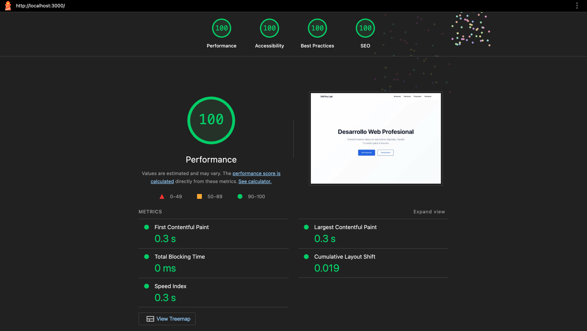

# VM Pro Lab

Professional landing page for VM Pro Lab - Web development studio founded by Fabián Veliz and Yuliana Mallorga.

## Project Philosophy

Minimalist page, straight to the point. We show who we are, what we do, and our projects. No filler.

## Tech Stack

- **HTML5** - Semantic and accessible
- **CSS3** - Vanilla, no frameworks
- **JavaScript** - Minimal, only for necessary interactions
- **Build Tools** - cssnano, terser, html-minifier (dev dependencies only)

## Project Structure

```
vm-pro-lab/
├── index.html          # Main source page
├── css/
│   └── styles.css      # Source CSS
├── js/
│   └── main.js         # Source JavaScript
├── images/             # Optimized images (WebP + JPG fallbacks)
│   ├── team/           # Team member photos
│   ├── projects/       # Project screenshots
│   └── docs/           # Documentation images
├── fonts/              # Self-hosted Inter font (WOFF2)
├── dist/               # Production build output (generated)
│   ├── index.html      # Minified HTML
│   ├── css/            # Minified CSS
│   ├── js/             # Minified JS
│   ├── images/         # All images (copied)
│   └── fonts/          # All fonts (copied)
├── docs/               # Audit reports and documentation
├── .claude/agents/     # Claude Code agent configurations
├── package.json        # Build scripts and dev dependencies
└── README.md           # This file
```

## Running the Project

### Development

1. **Clone the repository**
   ```bash
   git clone <repository-url>
   cd vm-pro-lab
   ```

2. **Install dependencies**
   ```bash
   npm install
   ```

3. **Start a local server**
   ```bash
   # With Python 3
   python3 -m http.server 8000

   # Or with Node.js (npx, no install needed)
   npx serve .

   # Or with VS Code Live Server extension
   # Right-click index.html > "Open with Live Server"
   ```

4. **Make changes**
   - Edit `index.html`, `css/styles.css`, or `js/main.js`
   - Refresh browser to see changes
   - No build step needed during development

### Building for Production

```bash
npm run build
```

This command will:
1. Clean the `dist/` folder
2. Minify CSS → `dist/css/styles.min.css`
3. Minify JavaScript → `dist/js/main.min.js`
4. Minify HTML → `dist/index.html` (with updated asset references)
5. Copy all fonts → `dist/fonts/`
6. Copy all images → `dist/images/`

The `dist/` folder is production-ready and can be deployed directly.

### Serving the Production Build

```bash
npm run build
npx serve dist
```

This serves the optimized production build at `http://localhost:3000`.

### Deployment

After building, deploy the contents of the `dist/` folder to your hosting provider:

```bash
# Deploy to a server via SCP
scp -r dist/* user@yourserver.com:/var/www/html/

# Deploy to Netlify
netlify deploy --prod --dir=dist

# Deploy to Vercel
vercel --prod dist/
```

### Available NPM Scripts

| Script | Description |
|--------|-------------|
| `npm run build` | Full production build (clean + minify + copy assets) |
| `npm run clean` | Remove the `dist/` folder |
| `npm run minify` | Minify CSS and JS only |
| `npm run minify:css` | Minify CSS to `dist/css/styles.min.css` |
| `npm run minify:js` | Minify JS to `dist/js/main.min.js` |
| `npm run minify:html` | Minify HTML to `dist/index.html` |
| `npm run copy:assets` | Copy fonts and images to `dist/` |

## Audit Results

The production build achieves perfect scores across all Lighthouse categories:



### Lighthouse Scores (Production Build)

| Category | Score |
|----------|-------|
| Performance | 100/100 |
| Accessibility | 100/100 |
| Best Practices | 100/100 |
| SEO | 100/100 |

### Core Web Vitals

| Metric | Desktop | Mobile | Threshold |
|--------|---------|--------|-----------|
| First Contentful Paint (FCP) | 0.3s | 0.9s | < 1.8s |
| Largest Contentful Paint (LCP) | 0.3s | 1.4s | < 2.5s |
| Cumulative Layout Shift (CLS) | 0.019 | 0 | < 0.1 |
| Total Blocking Time (TBT) | 0ms | 0ms | < 200ms |

### Accessibility Compliance

- **WCAG 2.1 Level AA**: Fully compliant
- **Color contrast**: All text meets 4.5:1 minimum ratio
- **Keyboard navigation**: Full support with focus management
- **Screen readers**: Semantic HTML, ARIA labels, skip links
- **Reduced motion**: Respects `prefers-reduced-motion`

### Performance Optimizations

- **Critical CSS inline** - Above-the-fold styles in `<head>`
- **Async CSS loading** - Non-critical styles loaded asynchronously
- **Self-hosted fonts** - Eliminates external font requests (WOFF2)
- **Font preloading** - Critical font weights preloaded with `crossorigin`
- **font-display: optional** - Eliminates layout shift from font swap (weight 700)
- **WebP images** - With JPG fallback using `<picture>` element
- **Lazy loading** - Images and Devicon CSS loaded when needed (IntersectionObserver)
- **GPU-optimized animations** - Using `transform` and `opacity` for 60fps
- **Resource hints** - `preconnect` and `dns-prefetch` for external domains
- **Minified assets** - CSS, JS, and HTML compressed for production
- **Minimal page weight** - ~89KB total (vs 2.2MB industry average)
- **Few HTTP requests** - Only 8 requests (vs 70+ average)

Full audit reports available in [`docs/`](docs/).

## Claude Code Agents

This project uses [Claude Code](https://claude.com/claude-code) with specialized agents for quality assurance. Each agent focuses on a specific domain and can be invoked during development to audit, review, or implement changes.

### Agent Overview

| Agent | Role | Invocation |
|-------|------|------------|
| **accessibility-auditor** | Audits WCAG compliance, screen reader support, keyboard navigation, color contrast, and ARIA correctness | Runs automatically on UI changes or on demand |
| **web-performance-auditor** | Runs Lighthouse audits, analyzes Core Web Vitals, identifies render-blocking resources and optimization opportunities | Invoked for performance analysis and regression detection |
| **vanilla-frontend-engineer** | Implements features using pure HTML5, CSS, and vanilla JavaScript following project conventions | Used for building and reviewing frontend code |
| **design-system-auditor** | Analyzes UI consistency, extracts design tokens, identifies pattern deviations across components | Used for design system reviews and consistency checks |

### How They Work Together

The agents form a quality pipeline that ensures changes maintain the project's high standards:

1. **Implementation**: The `vanilla-frontend-engineer` builds or modifies features using pure HTML/CSS/JS
2. **Accessibility review**: The `accessibility-auditor` checks WCAG compliance, verifying semantic HTML, ARIA attributes, color contrast ratios, and keyboard interactions
3. **Performance audit**: The `web-performance-auditor` runs Lighthouse against the production build, checking Core Web Vitals and identifying regressions
4. **Design consistency**: The `design-system-auditor` validates that UI changes follow established patterns (colors, spacing, typography, component structure)

Agents are configured in `.claude/agents/` and are invoked by Claude Code's orchestrator based on the type of task being performed. Each agent produces reports saved to `docs/`.

## Color Palette

- **Primary**: #0F172A (Very dark blue)
- **Accent**: #2563EB (Blue - WCAG AA compliant, 4.62:1)
- **Background**: #FFFFFF
- **Text**: #0F172A
- **Text Light**: #64748B
- **Success**: #047857 (Green - WCAG AA compliant, 4.52:1)

## Typography

- **Font**: Inter (self-hosted WOFF2)
- **Weights**: 400 (regular), 600 (semibold), 700 (bold)
- **font-display**: swap (400, 600) / optional (700 - prevents CLS)

## Authors

**VM Pro Lab**
- Fabián Veliz
- Yuliana Mallorga

---

Last updated: 2026-02-11
